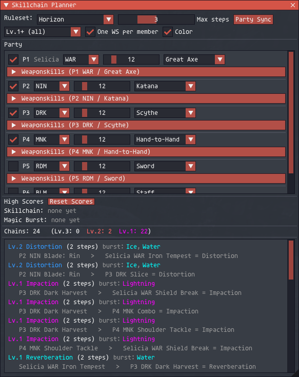

# Skillchain Planner

A **party skillchain planner** for the level‑75 era (through Chains of Promathia).
Build a party (select job, level, and weapon per member), pick which
weaponskills each member has, and see **every skillchain the party can make**,
ranked by skillchain tier (Lv.3 Light/Darkness > Lv.2 > Lv.1).

This is *not* the same as the real‑time `chains` addon. It reuses that addon's skillchain
data and resonance rules (see credits below) and adds a party model, a
weaponskill‑availability layer, and a chain‑enumeration engine. It can also
optionally sync jobs and levels from your current party with **Party Sync**.

The default ruleset is **Horizon**; a **Retail (CoP)** ruleset is also selectable.
SCP also tracks packet-observed high scores for skillchain damage and magic
burst damage while the addon is loaded.



## Installation

Download the latest ZIP file from the
[SCP Releases page](https://github.com/AnnaNomoly/scp/releases/latest), then
extract the `scp` folder into your HorizonXI addons directory.

Example install path:

```
C:\Horizon XI\HorizonXI\Game\addons\scp
```

The folder should look like this:

```
HorizonXI/
└── Game/
    └── addons/
        └── scp/
            ├── scp.lua
            ├── sc_data.lua
            ├── ws_data.lua
            ├── jobs.lua
            ├── engine.lua
            ├── high_scores.lua
            ├── LICENSE
            ├── NOTICE.md
            └── README.md
```

Then in‑game:

```
/addon load scp
```

To load it automatically, add `/addon load scp` to your Ashita
startup script.

## Usage

Open/close the window:

```
/scp
/scplanner
```

**Top controls**
- **Ruleset**: Horizon (default) or Retail (CoP). Changes which weaponskill
  properties are used. (See *Rulesets* below.)
- **Max steps**: how many weaponskills deep to search (2-5). Default 3, which
  is enough to reach Light/Darkness. Higher values find longer chains but search
  more combinations.
- **Party Sync**: fills the six party slots from your current party once,
  using current party job, level, and name. Weapons are reset to the planner's
  preferred weapon for each job.
- **Lv filter**: show all chains, only Lv.2+, or only Lv.3 (Light/Darkness).
- **One WS per member**: if on, each member contributes at most one weaponskill
  per chain (realistic for a coordinated party burst). If off, a member may
  appear more than once (e.g. a SAM self‑skillchaining).
- **Color**: toggle property/element coloring.

**Party** (6 slots)
- Enable the checkbox to include a member.
- Pick **job**, **level** (1-75), and **weapon**. The weapon list only shows
  weapons that job can use.
- Expand **Weaponskills** to choose which WS that member has. This is the
  *hybrid* model:
  - **Auto** checks the WS the job is expected to have at that level/skill.
  - **All** / **None** select everything / nothing.
  - Individual checkboxes let you fine‑tune.
  - **Relic: ...** includes the weapon's Relic weaponskill (off by default, since
    it requires that relic). Changing job or weapon re‑runs Auto.

**Results** are listed best‑first. Each row shows the resulting skillchain, its
tier, the number of steps, its **magic‑burst elements**, and the full sequence
(which member uses which WS, with the intermediate skillchain after each step).

**High Scores** tracks the largest skillchain damage and magic burst damage seen
in inbound action packets while SCP is loaded. It uses packet message IDs, not
chat-log parsing. Skillchain healing messages and drain/status-only magic burst
messages are ignored. Use **Reset Scores** in the window, or `/scp scores reset`,
to clear the saved records.

Other commands:

```
/scp show | hide      # Sets visibility
/scp horizon | retail # Sets ruleset
/scp sync             # Toggles party sync
/scp steps <2-5>      # Sets step filters
/scp scores           # Prints records to chat window
/scp scores reset     # Resets recorded scores
/scp reset            # restore the default party
```

Your party and settings are saved automatically (per character).

## How ranking works

Ranking is done **purely by skillchain tier**:

1. **Lv.3**: Light, Darkness
2. **Lv.2**: Fusion, Fragmentation, Distortion, Gravitation
3. **Lv.1**: Transfixion, Compression, Liquefaction, Scission, Reverberation,
   Induration, Impaction, Detonation

Ties are broken by fewest steps, then by name. The burst elements and closing
weaponskill are shown for every result, but they do **not** affect the ranking.

A search branch stops as soon as it reaches a Lv.3 (Light/Darkness) result, which
matches the level‑75 era: there is no Aeonic Radiance/Umbra and no
double‑Light/Darkness continuation.

## Rulesets

The properties shipped here come from the `chains` addon's `skills.lua`, which is
**Horizon‑flavored** (for example it overrides *Catastrophe* from the retail
`Darkness/Gravitation` to `Fusion/Compression`). So the **Horizon** ruleset is
accurate to that data set.

The **Retail (CoP)** ruleset is wired up and selectable, but it currently differs
from Horizon **only where the source data evidences a difference** (right now:
Catastrophe). It was built offline without wiki access, so other retail‑vs‑Horizon
property deltas have **not** been guessed at, to avoid inventing wrong data. To
extend it, add `retail = { ... }` overrides to the relevant weaponskills in
`ws_data.lua` (there's a comment marking the spot). Any WS without a `retail`
override simply uses the Horizon properties.

## File overview

- **`sc_data.lua`**: skillchain formation table (`chainInfo`), tiers, burst
  elements, colors. Ported from the `chains` addon.
- **`ws_data.lua`**: through‑CoP weaponskills by weapon type, with Horizon
  properties, optional retail overrides, relic flags, and skill thresholds.
- **`jobs.lua`**: the 15 through‑CoP jobs, the weapon skill‑grade matrix, the
  level‑75 skill caps, and the WS‑availability helper.
- **`engine.lua`**: skillchain enumeration + tier ranking (pure logic).
- **`high_scores.lua`**: inbound 0x28 action packet parser and skillchain /
  magic burst high score tracker.
- **`LICENSE`**: SCP license notice.
- **`NOTICE.md`**: upstream attribution and third-party notices.
- **`scp.lua`**: the addon: UI, settings, commands, render loop.

## License

SCP is distributed under the **GNU General Public License, version 3 or later**
(`GPL-3.0-or-later`).

This is because SCP includes data derived from the GPL-licensed `chains` addon,
including the skillchain formation table ported into `sc_data.lua`.

Weaponskill names, action IDs, and skillchain property lists in `ws_data.lua`
are ported from Ivaar's `skills.lua` data used by `chains`; its BSD-style notice
is preserved in `NOTICE.md`.

See `LICENSE` and `NOTICE.md` for the redistribution notices.

## Credits

Skillchain data and resonance rules are from the **`chains`** addon by
**Ivaar, Sippius, and NerfOnline** (`skills.lua` © Ivaar, 2017). This planner is
a separate tool built on top of that data.
